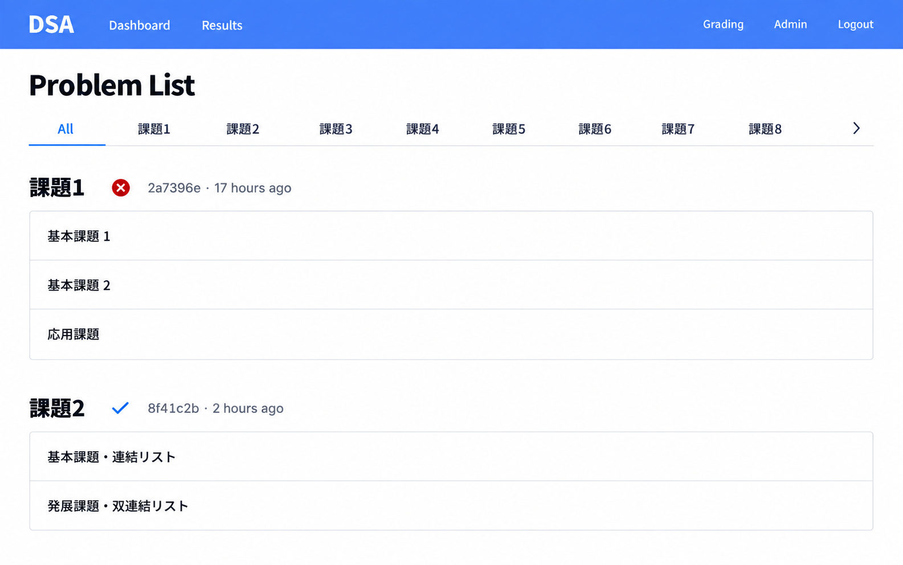
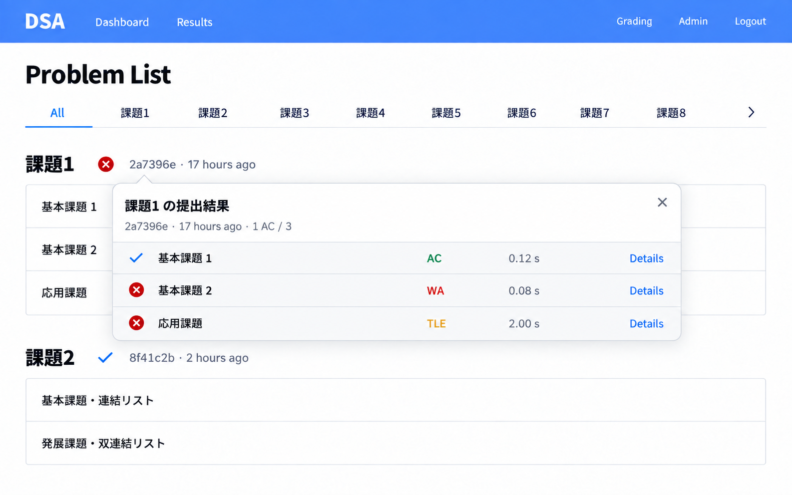
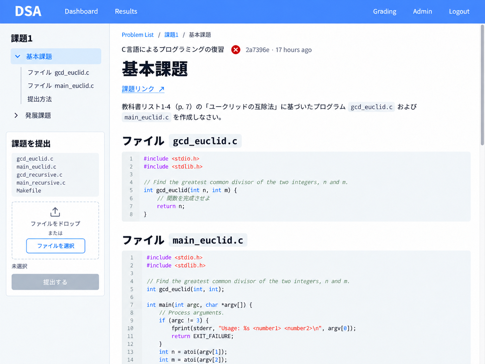
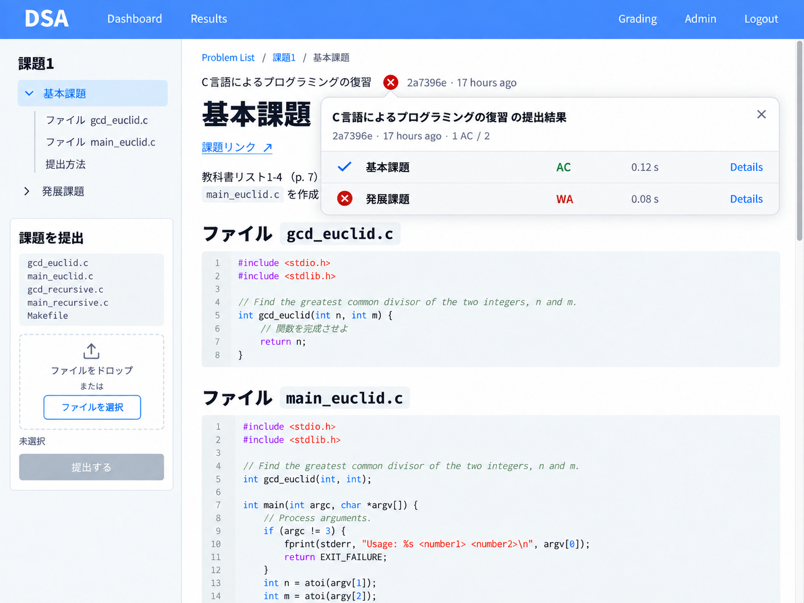
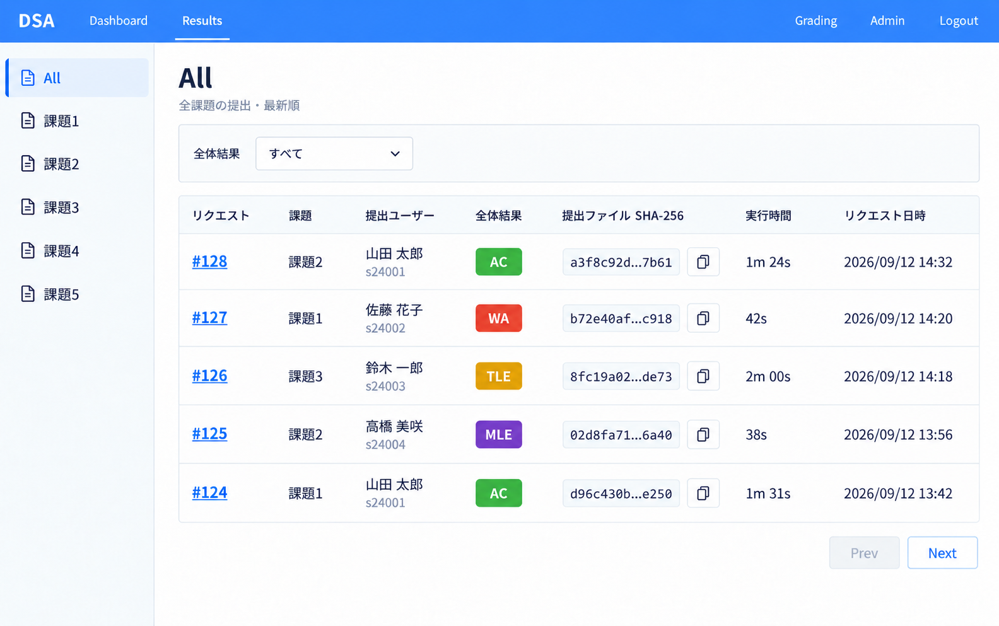
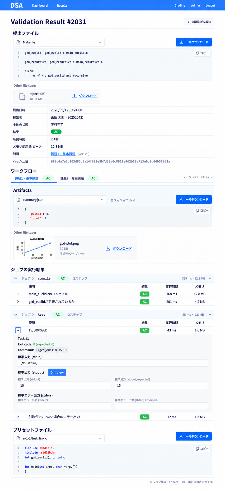

# ページデザイン案

課題一覧・課題詳細・CI結果一覧・CI結果詳細の採用デザイン。画像生成で作成した静的なモックアップを、ページと表示状態ごとに保存する。

| ページ | 通常表示 | 提出結果ポップオーバー | 生成・編集プロンプト |
| --- | --- | --- | --- |
| 課題一覧 | [画像](problem-list/default.png) | [画像](problem-list/results-popover.png) | [履歴](problem-list/prompts.md) |
| 課題詳細 | [画像](problem-detail/default.png) | [画像](problem-detail/results-popover.png) | [履歴](problem-detail/prompts.md) |
| CI結果一覧 | [画像](validation-results/default.png) | — | [履歴](validation-results/prompts.md) |
| CI結果詳細 | [画像](validation-detail/default.png) | — | [履歴](validation-detail/prompts.md) |

画像内のユーザー名・日時・ハッシュ値・実行時間などは表示例。生成プロンプトは制作時の記録で、参照画像を含む完全な再生成手順ではない。文言やStatusなどの実装時の定義は[ドメイン用語](../../CONTEXT.md)と[仕様](../spec/README.md)を参照する（プロンプト中の `CLE` は現行Statusの定義に含まれない）。

## 課題一覧

課題ごとに配下の問題を並べる。

- `/projects` に配置し、Dashboard から開く。All／課題別タブは取得済み一覧を絞り込み、ページ遷移しない。
- 問題名の遷移先は最新版の課題詳細の該当 Workflow。
- 課題一覧・詳細の提出サマリーは実装対象外。画像内の提出状況・ハッシュ・経過時間・提出結果ポップオーバーは過去のデザイン案として残す。CI結果は結果一覧・詳細で確認する。

## 課題詳細

左側にアコーディオン形式のナビゲーションと提出フォーム、右側に課題説明とコードを配置する。

## CI結果一覧

左側で課題を選択し、ユーザーID・ユーザー名・Submissionのハッシュによる検索と全体結果の絞り込みを配置する。Requestごとの提出ユーザー・Status・ハッシュ・実行時間・日時を表で表示する。

## CI結果詳細

提出ファイル、Requestの情報、Workflowの切り替え、Artifact、JobとStepの実行結果、Preset Fileを縦に配置する。Stepの表は横罫線で区切り、展開時にコマンド・終了コード・標準入出力・期待値を表示する。

