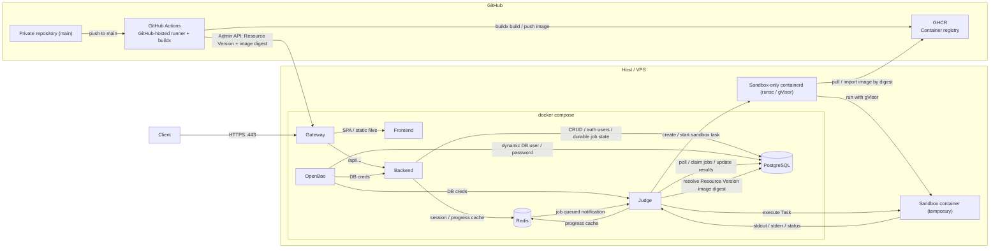

# オンラインジャッジWebアプリ 仕様書

## 概要
プログラミング演習課題のオンラインジャッジWebアプリケーション

| 項目 | 内容 |
| -- | -- |
| プロジェクト名 | dsa-project |
| 目的 | 提出されたファイルに対して、あらかじめ設定されたCI Workflow を実行し、採点補助に役立てる |

## 用語集

- Project : 複数のCI Workflow からなるプロジェクト単位
- CI (Continuous Integration) : 提出された Submission に対して、整合性チェックを行うこと
- Workflow : 実行される CI のパイプライン全体
- Job : 独立VM/コンテナ内で実行される実行単位
- Step : シェルコマンド 1 個程度の実行単位
- Request : CI をリクエストすること
- Artifact : CI Workflow によって生成された File / url などのリソース
  - Mermaid の diagram など

- Resource : Project を定義するために作成されたリソースファイル
  - CI Workflow を定義したファイルや、他 Makefile やプログラムファイルなどのリソース
  - Sandbox用コンテナイメージのビルド定義 (Dockerfile)
- Submission : Project に紐づいた CI Workflow の実行をリクエストする際に提出するファイル
  - プログラムファイルや `report.pdf` などのメディアファイル、CI Workflow ごとのcontext dir 等を示した メタデータファイル
- Version : Resource や Submission のバージョン
  - 日時とハッシュ値で構成される

## 対象ユーザー

| Role | 人数 | 権限 |
| -- | -- | -- |
| Admin | 1 | ManagerおよびUserの作成・削除、課題の作成・更新・削除 |
| Manager | 4~5 (想定) | 全ユーザーの提出物をまとめて Request する |
| * (全員) | 90~100 (想定) | 自身の提出物をリクエストする |

## システム要件

### 機能要件
- ユーザー認証・認可
- CI Request
  - 提出
  - 結果の表示
- Admin 機能
  - ユーザーの作成・削除・並び変え
    - 作成: シングルユーザーの作成、およびスプレッドシートから複数ユーザーの一括作成
  - Resource の作成・更新・削除
    - CI Workflow Resource は GitHub org の private repository で管理する
    - main ブランチ更新時に GitHub Actions が sandbox 用コンテナイメージを build / push し、Backend の Admin API に新しい Resource を登録する
- Manager 機能
  - 複数のユーザーが提出した Submission を全て一つにまとめたzipファイルをアップロードし、まとめて Request する。
  - フォーマットが微妙に異なることで CI が通らない提出に対して、その場で修正して再 Request することができる
- Resource の Version 管理
  - Resource を更新しても古い Version を参照できる
  - 複数の Version に対して Request することができる
    - 差分を確認するため
  - CI Workflow Resource の Version には、GitHub の commit SHA、GitHub Actions の workflow run ID、GHCR の image digest を紐づける
  - Request 実行時は Version に固定された image digest を参照する

### 非機能要件
- セキュリティ
  - ログイン認証時に、ロール毎に異なる権限を設定
  - GitHub Actions から Backend への Resource Version 登録は、CI 専用 Admin API で行う
    - CI 専用の権限は Resource Version の作成に限定する
    - source repository、branch、commit SHA、workflow run ID、image digest を監査ログに残す
  - sandbox上での任意のコード実行時のセキュリティ
    - CPUコア数、メモリ使用量の制限
    - 実行時間制限
    - フォルダ・ファイルの読み込み・書き込み制限
    - ネットワークアクセス制限
  - 監視・ログ収集
    - Beszel のダッシュボードで Host / Container の CPU・メモリ・ディスク・ネットワーク負荷を監視
    - Uptime Kuma で HTTPS / Backend API / Judge API 等の外形監視を行う
    - WARN以上のログはアプリケーション側でメール通知する
    - 高負荷時にメール・Slackメッセージで通知
- パフォーマンス
  - 同時アクセス対応
    - 必要に応じて、バックエンドサーバーの Pod 数を増やしてスケーリングさせる
- 可用性
  - 24時間稼働
- 可搬性
  - 簡単にデプロイできる
    - ハイパラメータを設定する箇所が少ない、または一か所にまとまっている。
    - コマンド一つでデプロイできる。
    - 初回起動時にのみ初期設定用 Web UI が表示され、Admin アカウントのパスワード等を指定できる。

## システム構成

### アーキテクチャ

* PostgreSQL: データの永続化 (User, Resource, Request, etc)
  - ジョブキューも保存する
* Redis: 一時的なデータの共有
  - セッション情報
  - CI Workflow などの短期 progress cache
  - Judgeサーバーへの notify
* OpenBao: secret管理
* GitHub private repository: CI Workflow Resource の管理
  - main ブランチ更新を Resource 更新の入口とする
* GitHub Actions: sandbox 用コンテナイメージの build / push と Resource Version 登録
  - GitHub-hosted runner 上で buildx / BuildKit を用いる
  - Backend の CI 専用 Admin API に Resource Version や Image Digest 等の情報を登録する
* GHCR: sandbox 用コンテナイメージの registry
  - Resource Version には tag ではなく `repo@sha256:...` 形式の digest を固定して記録する
  - Judge / sandbox-only containerd は digest 指定で pull / import する
* sandbox: gVisor(runsc) + 専用 containerd
  - CPU / memory / pids / 実行時間 / stdout・stderr size の制限
  - network egress の既定 deny
  - capabilities drop
  - `no_new_privileges`
  - job 終了後 cleanup、監査ログを必須とする。

### 技術選定
- フロントエンド: React (Vite) + TypeScript + TailwindCSS
- バックエンド: Go
  - バックエンドフレームワーク: [Echo](https://github.com/labstack/echo)
  - ORM: [Bun](https://github.com/uptrace/bun)
  - Validator: [GoPlayground/validator](https://github.com/go-playground/validator)
- 認証: Backend-managed session cookie
- データベース: PostgreSQL
- セッション・進捗キャッシュ・ジョブ通知: Redis
- Secret 管理: OpenBao
- オブジェクトストレージ: Seaweedfs
- CI Workflow Resource 管理:
  - GitHub org private repository
  - GitHub Actions (GitHub-hosted runner + buildx / BuildKit)
  - GHCR (Container registry)
- ジャッジサーバー: Go
  - ORM: [Bun](https://github.com/uptrace/bun)
  - Sandbox: VM / VPS 環境では gVisor(runsc) + sandbox 専用 containerd
- 運用負荷監視サーバー: Beszel
- 外形監視: Uptime Kuma
