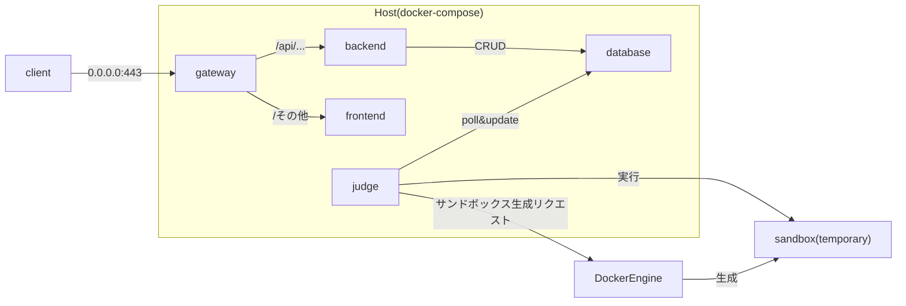

# オンラインジャッジWebアプリ 仕様書

## 概要
プログラミング演習課題のオンラインジャッジWebアプリケーション

| 項目 | 内容 |
| -- | -- |
| プロジェクト名 | dsa-project |
| 目的 | 提出されたプログラムのTask（コンパイル及び実行）を自動でチェックし、判定補助に役立てる |

## 対象ユーザー

| 項目 | 人数 | 内容 |
| -- | -- | -- |
| Admin | 1 | ManagerおよびUserの作成・削除、課題の作成・更新・削除 |
| Manager | 4~5 (想定) | 全てのTaskを実行 |
| User | 90~100 (想定) | 一部Taskを実行 |

## システム要件

### 機能要件
- ユーザー認証・認可システム
- コード提出システム
  - 提出されたコードをsandbox上でコンパイル・実行し、結果を表示
  - 以下のリクエストを実行することができる
    - Fullリクエスト: 一部のTaskのみ実行し、自動チェックができるか確認
    - Partialリクエスト: 全てのTaskを実行する。Manager, Adminのみ可
- 結果表示システム
  - Taskの実行結果を表示
- Admin機能
  - ユーザーの作成・削除・並び変え
    - 作成: シングルユーザーの作成、およびスプレッドシートから複数ユーザーの一括作成
  - 課題リソースの作成・更新・削除
    - 課題は複数のSuiteで構成される ("基本課題", "発展課題", etc) 
    - 各Suiteは複数のStageで構成される ("Build", "Judge", "PostProcess", etc)
    - 各Taskはタスク名、実行コマンド、想定出力(stdout/stderr/return code)で構成される
- Manager機能
  - ユーザーが提出したファイルを一つにまとめたzipファイルをアップロードし、まとめて提出・Task実行する。
  - フォーマットが微妙に異なることでTaskが通らない提出に対して、その場で修正して再チェックすることができる

### 非機能要件
- セキュリティ
  - ログイン認証時に、ロール毎に異なる権限を設定
  - 1日が経過すると自動でログアウト
  - パスワードはハッシュ化して保存
  - sandbox上での任意のコード実行時のセキュリティ
    - CPUコア数、メモリ使用量の制限
    - 実行時間制限
    - フォルダ・ファイルの読み込み・書き込み制限
    - ネットワークアクセス制限
  - 監視・ログ収集
    - ダッシュボードでシステム負荷を監視
    - WARN以上のログをメールで通知
    - 高負荷時にメール・Slackメッセージで通知
  - 開発
    - データベースのパスワード、シークレットトークン等はGitリポジトリにハードコーディングせず、Gitで追跡していないenvファイルで設定する。もしくはDocker Secretsを使用する。
  - sandbox実行
    - Task実行は全てVM上のsandboxコンテナ上で実行される
    - VM, sandboxそれぞれで計算リソース制限、ネットワーク制限を行う
- パフォーマンス
  - 同時アクセス対応
    - 必要に応じて、バックエンドサーバーのプロセス数を増やしてスケーリングさせる
  - sandbox環境のパフォーマンス
    - Task実行を高速に行える
- 可用性
  - 24時間稼働
- 可搬性
  - 簡単にデプロイできる
    - ハイパラメータを設定する箇所が少ない、または一か所にまとまっている。
    - コマンド一つでデプロイできる。

## システム構成

### アーキテクチャ

TODO: updateする

### 技術選定
- フロントエンド: React (Vite) + TypeScript + TailwindCSS
- バックエンド: Go
  - バックエンドフレームワーク: [Echo](https://github.com/labstack/echo)
  - ORM: [Bun](https://github.com/uptrace/bun)
  - Validator: [GoPlayground/validator](https://github.com/go-playground/validator)
- 認証サーバー: Ory Kratos
- データベース: PostgreSQL
- ジャッジサーバー: Go
  - ORM: [Bun](https://github.com/uptrace/bun)
  - Sandbox: Firecrackerで立てたVMでsandboxを立てる

### 用語集
- Task: 課題ごとに設定されている処理単位
- Request: 提出されたソースコードに対してタスクを実行するリクエスト
