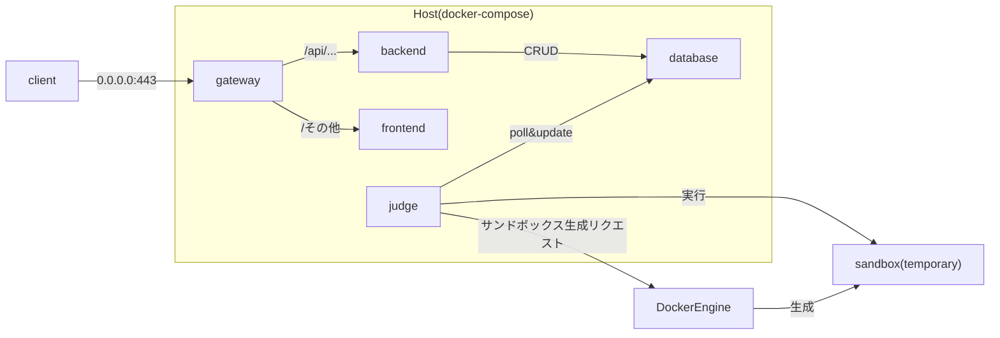

# オンラインジャッジWebアプリ 仕様書

## 概要
プログラミング演習課題のオンラインジャッジWebアプリケーション

| 項目 | 内容 |
| -- | -- |
| プロジェクト名 | dsa-project |
| 目的 | 課題で提出されたプログラムのTestcase（コンパイル及び実行）を自動でチェックし、採点補助に役立てる |

## 対象ユーザー

| 項目 | 人数 | 内容 |
| -- | -- | -- |
| Admin | 1 | ManagerおよびStudentの作成・削除、課題の作成・更新・削除 |
| Manager | 4~5 (想定) | Gradingの実行（全てのTestcaseを実行） |
| Student | 90~100 (想定) | Validationの実行（一部Testcaseが通るか確認） |

## システム要件

### 機能要件
- ユーザー認証・認可システム
- コード提出システム
  - 提出されたコードをsandbox上でコンパイル・実行し、結果を表示
  - 以下のリクエストを実行することができる
    - Validationリクエスト: 一部のTestcaseのみ実行し、自動採点ができるかチェック
    - Gradingリクエスト: 全てのTestcaseを実行する。Manager, Adminのみ可
- 結果表示システム
  - Testcaseの実行結果を表示
- Admin機能
  - ユーザーの作成・削除・並び変え
    - 作成: シングルユーザーの作成、およびスプレッドシートから複数ユーザーの一括作成
  - Lecture・Problemの作成・更新・削除
- Manager機能
  - 学生が提出したファイルを一つにまとめたzipファイルをアップロードし、まとめてGradingリクエストを提出する。
  - フォーマットが微妙に異なることでチェックができない提出に対して、その場で修正して再チェックすることができる

### 非機能要件
- セキュリティ
  - ログイン認証時に、ロール毎に異なる権限を設定
  - 時間が経過すると自動でログアウト
  - パスワードはハッシュ化して保存
  - sandbox上での任意のコード実行時のセキュリティ
    - CPUコア数、メモリ使用量の制限
    - 実行時間制限
    - フォルダ・ファイルの読み込み・書き込み制限
    - ネットワークアクセス制限
  - 監視・ログ収集
    - ダッシュボードでシステム負荷を監視
    - WARN以上のログをメールで通知
    - 高負荷時にメール・Slackメッセージで通知
  - 開発
    - データベースのパスワード、シークレットトークン等はGitリポジトリにハードコーディングせず、Gitで追跡していないenvファイルで設定する。もしくはDocker Secretsを使用する。
- パフォーマンス
  - 同時アクセス対応
    - 必要に応じて、バックエンドサーバーのプロセス数を増やしてスケーリングさせる
  - sandbox環境のパフォーマンス
    - Testcase(コンパイル・実行)のチェックを高速に行える
  - データベースのパフォーマンス
    - 不必要なデータはログに格納し、データベースから削除する
      - バリデーション結果は１週間単位でログに移す
- 可用性
  - 24時間稼働
- 可搬性
  - 簡単にデプロイできる
    - ハイパラメータを設定する箇所が少ない、または一か所にまとまっている。
    - コマンド一つでデプロイできる。

## システム構成

### アーキテクチャ

### 技術選定
- フロントエンド: React (Vite) + TypeScript + TailwindCSS
- バックエンド: Go
  - バックエンドフレームワーク: [Echo](https://github.com/labstack/echo)
  - ORM: [Bun](https://github.com/uptrace/bun)
  - Validator: [GoPlayground/validator](https://github.com/go-playground/validator)
- 認証サーバー: Ory Kratos
- データベース: PostgreSQL
- ジャッジサーバー: Go
  - ORM: [Bun](https://github.com/uptrace/bun)
  - Sandbox: Docker SDK for Go

### 用語集
- Testcase: 課題ごとに設定されているタスク。以下の種類がある。
  - Build Testcase: ソースコードをコンパイルするタスク
  - Judge Testcase: コンパイルされたプログラムを実行し、与えられた入力に対して想定された出力をするか確認するタスク
- Request: 提出されたソースコードに対してタスクを実行するリクエスト。以下の種類がある。
  - Validation Request
    - 提出されたソースコードがコンパイルが通るか、実行ができるか確認すること。一部Testcaseのみ実行される。
    - ユーザが試行錯誤で何回も頻繁にリクエストされることを想定している。
    - 古いリクエスト結果は重要ではない。
  - Grading Request
    - 提出されたソースコードに対して全てのTestcaseを実行し、結果を表示すること。
    - 別の提出プラットフォーム(Manaba等)で提出されたソースコードをジャッジすることを想定している。
    - 古いリクエスト結果も重要である。
- Lecture (授業): 複数の課題を含む、授業の単位。具体例としては、「ハッシュ」「木構造」「グラフ」「動的計画法」等がある。
- Problem (課題): 授業内の課題。具体例としては、「必須課題1」「必須課題2」「応用課題」等がある。

