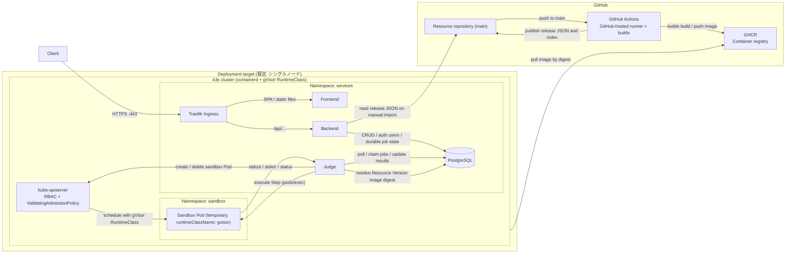

# オンラインジャッジWebアプリ 仕様書

このドキュメントは要件とシステム構成の概観を所有する。詳細は各仕様ファイルが所有し、ここでは繰り返さない。

## 仕様ファイル

- Resource の形式・公開手順・実行規則は [dsa-resource-spec v1.3.0](https://github.com/dsa-uts/dsa-resource-spec/tree/v1.3.0/docs) を参照する。形式の定義は複製しない
- [Resource 取り込み仕様](resource-imports.md) — GitHub からの取得・検証・DB 保存・認証設定・E2E 方針
- [REST API 仕様](../../api/openapi.yaml) — クライアント向け REST API の形(single source of truth、ADR 0010)。[api.md](./api.md) は Conventions と未実装エンドポイントの草稿
- DB スキーマは [backend/internal/store/migrations/](../../backend/internal/store/migrations/) の SQL ファイルが正(Markdown の複製は持たない)

用語と Principles は [../../CONTEXT.md](../../CONTEXT.md) を正とする。

## 概要
プログラミング演習課題のオンラインジャッジWebアプリケーション

| 項目 | 内容 |
| -- | -- |
| プロジェクト名 | dsa-project |
| 目的 | 提出された Submission に対して、あらかじめ設定された Workflow を実行し、採点補助に役立てる |

## 対象ユーザー

| Role | 人数 | 権限 |
| -- | -- | -- |
| Admin | 1 | ManagerおよびUserの作成・削除、課題の取り込み・更新・公開管理 |
| Manager | 4~5 (想定) | 全ユーザーの提出物をまとめて Request する |
| * (全員) | 90~100 (想定) | 自身の提出物をリクエストする |

## システム要件

### 機能要件
- ユーザー認証・認可
- Request
  - 提出
  - 結果の表示
- Admin 機能
  - ユーザーのグローバル表示順の手動並び替え（無効化済みを含み、System Account を除く）
  - ユーザーの作成・削除
    - 作成: シングルユーザーの作成、およびスプレッドシートから複数ユーザーの一括作成
  - Resource の取り込み・更新
    - 環境ごとに 1 つの GitHub リポジトリを環境変数で固定する。Dev / Prod は private、E2E は public を使う
    - Admin が課題 ID・正式版 SemVer を指定し、公開済み JSON を同期的に取得・検証して DB に保存する
    - 初回は未公開の Project を作成する。更新時はタイトルを追従させ、公開日時・締切・表示順を維持する
    - リポジトリから消えた Project も維持し、公開停止は手動で行う
- Manager 機能
  - 複数のユーザーが提出した Submission を全て一つにまとめたzipファイルをアップロードし、まとめて Request する。
  - フォーマットが微妙に異なることで Request が失敗する提出に対して、その場で修正して再 Request することができる
- Resource Version 管理
  - 同じ Version の再取り込みは外部アクセスせず変更なし。古い Version は拒否し、ロールバックは設けない
  - 新規・手動再実行とも Request 作成時点の最新版に固定する。Version の指定は受け付けない
  - validation / evaluation とも自動再採点は行わない
  - 結果一覧は Request 単位で Version を明示する。学生も自分の過去 Version のバリデーション結果を閲覧でき、本採点も過去の結果を保持する
  - 課題詳細は常に最新版を参照する
  - Request 実行時は保存済み JSON に固定された image digest を参照する。取り込み時にはイメージ取得・存在確認をしない

### 非機能要件
- セキュリティ
  - ログイン認証時に、ロール毎に異なる権限を設定
  - Resource の取り込みは Admin のみ許可する。`dsa-resource-spec v1.3.0` の関数で JSON を検証し、指定 ID・Version と index のハッシュを照合する
  - リポジトリと GHCR の認証情報は別設定とし、public では省略可能。保存・注入方式は未定
  - sandbox 上での任意のコード実行は resource limit と platform 固定 hardening で隔離する([Resource 定義書](https://github.com/dsa-uts/dsa-resource-spec/blob/v1.3.0/docs/resource.md) 参照)
- 可用性
  - 24時間稼働
- 可搬性
  - 簡単にデプロイできる
    - 環境共通の設定はKustomize base、開発環境差はdev overlayにまとまっている。
    - 外部管理のk3sへ環境overlayをデプロイコマンド一つで適用できる。
    - 初回起動時にのみ初期設定用 Web UI が表示され、Admin アカウントのパスワード等を指定できる。

## システム構成

### アーキテクチャ

* PostgreSQL: データの永続化 (User, Resource, Request, etc)
  - セッション情報、Workflow の進捗、ジョブキュー、検証済みの Resource JSON を保存する
* GitHub repository: Resource の管理（Dev / Prod は private、E2E は public）
  - main ブランチ更新を Resource 更新の入口とする
* GitHub Actions: sandbox 用コンテナイメージの build / push と release JSON・index の公開
  - GitHub-hosted runner 上で buildx / BuildKit を用いる
  - Backend APIは呼ばない。手動インポート完了までは現在のResource Versionを維持する
* GHCR: sandbox 用コンテナイメージの registry
  - Digest Pinning に従い、k3s 内蔵 containerd は digest 指定で pull する
* k3s: コンテナ基盤
  - 全サービスと sandbox を同一クラスタに載せ、Namespace (services / sandbox) で分離する
  - manifest は Topology-Agnostic Manifests に従う。デプロイの既定はシングルノード (ADR 0008)
  - Traefik Ingress が TLS 終端と Frontend / Backend への振り分けを担う
  - デプロイはKustomize baseと環境overlayから行い、環境差をoverlayに集約する
* sandbox: gVisor(runsc) RuntimeClass を指定した一時 Pod
  - Judge が sandbox Namespace に Pod を直接作成し (`restartPolicy: Never`)、Step を pods/exec で逐次実行して stdout / stderr / exit code を回収する
  - Judge の ServiceAccount には sandbox Namespace 限定の Role のみを与える (pods の create/get/list/watch/delete、pods/exec、pods/log)。Judge 自身の Namespace への権限は持たないため、自身や他サービスの Pod は操作できない
  - ValidatingAdmissionPolicy で sandbox Pod の image を GHCR の特定 org 配下かつ digest 指定必須に制限し (Digest Pinning の強制層)、hostPath volume を禁止する
  - Sandbox Workspace / Preset Directory の受け渡しと Artifact 回収は pods/exec loader 方式。詳細は ADR 0009 が所有する
  - Isolated Job Workspace / Explicit Artifact Handoff / Private-by-Default に従う
  - resource limit と platform 固定 hardening(network deny、capabilities drop 等)の詳細は [Resource 定義書](https://github.com/dsa-uts/dsa-resource-spec/blob/v1.3.0/docs/resource.md) が所有する

### 技術選定
- コンテナ基盤: k3s (containerd 内蔵、gVisor RuntimeClass)
- デプロイ: Kubernetes manifest + Kustomize (共通設定はbase、環境差はoverlay)
- Ingress: k3s 内蔵 Traefik (TLS 終端、Frontend / Backend への振り分け)
- フロントエンド: React (Vite) + TypeScript + TailwindCSS
- バックエンド: Go
  - バックエンドフレームワーク: [Echo](https://github.com/labstack/echo)
  - ORM: [Bun](https://github.com/uptrace/bun)
  - Validator: [GoPlayground/validator](https://github.com/go-playground/validator)
- 認証: Backend-managed session cookie
- データベース: PostgreSQL
- セッション・進捗・ジョブキュー: PostgreSQL
- Secret 管理: 環境が `dsa-datastore` Kubernetes Secret を提供する。production方式は未定
- オブジェクトストレージ: Seaweedfs
- Resource 管理:
  - 環境ごとに固定した GitHub repository
  - GitHub Actions (GitHub-hosted runner + buildx / BuildKit)
  - GHCR (Container registry)
- ジャッジサーバー: Go
  - ORM: [Bun](https://github.com/uptrace/bun)
  - Sandbox: gVisor(runsc) RuntimeClass を指定した k8s Pod (sandbox 専用 Namespace)
